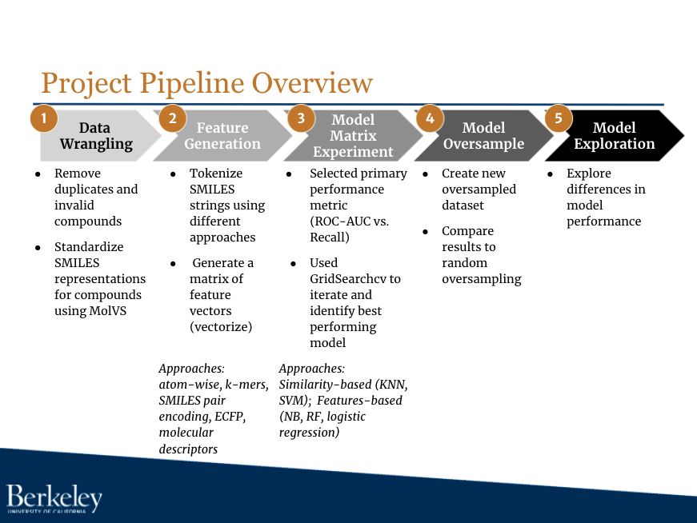

## Tox21 Structure-Activity Relationship Models

### Final Project - W207 Applied Machine Learning (Summer 2021)

In this project, we explore combinations of featurization techniques and simple classifier models to study structure-activity relationships using the NR-AhR dataset from the [Tox21 Data Challenge](https://tripod.nih.gov/tox21/challenge/about.jsp).

All the code for our **project pipeline** can be found in the **[final_code](https://github.com/LimaEchoAlpha/tox21_ml_class_project/tree/main/final_code)** folder.  The notebooks in this folder are arranged in the same order as the project pipeline detailed below.

